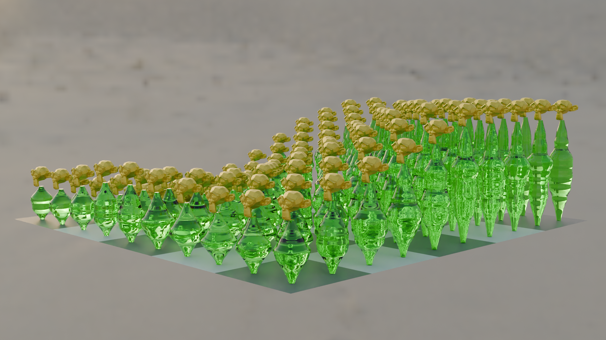
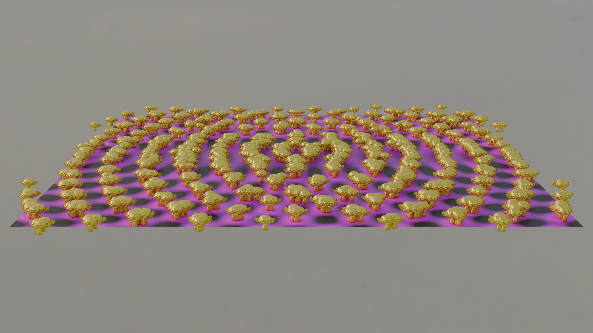

# Geometry Nodesでジェネってみた

BlenderのGeometry Nodesを試す。

## スライド
https://docs.google.com/presentation/d/1o7wxbbRAPZ5vCvu2Gq8BopQMaI31N0w5ChrKMPteUZA/edit?usp=sharing

## 画像

## 動画
[grid-wave](./grid-wave0000-0240.mp4)
[move-by-height](./move-by-height0000-0240.mp4)
